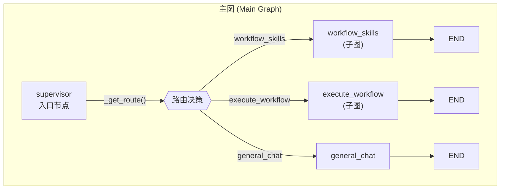
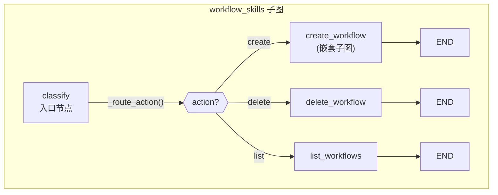
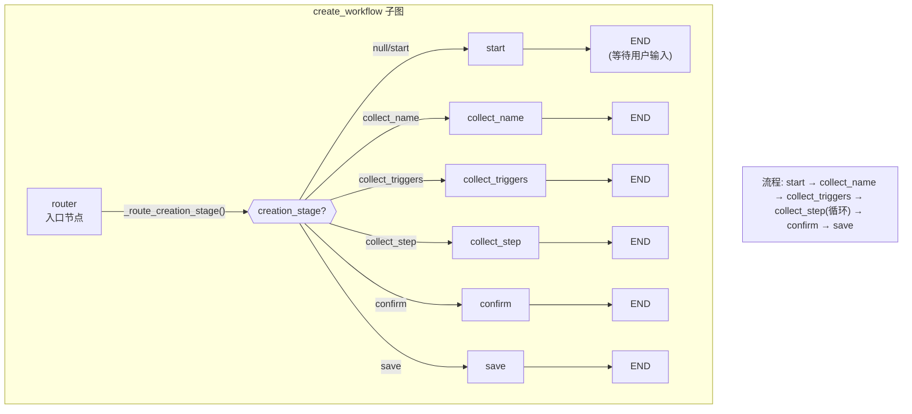
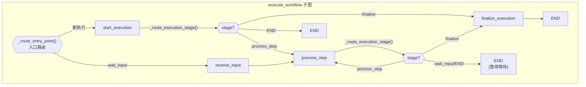
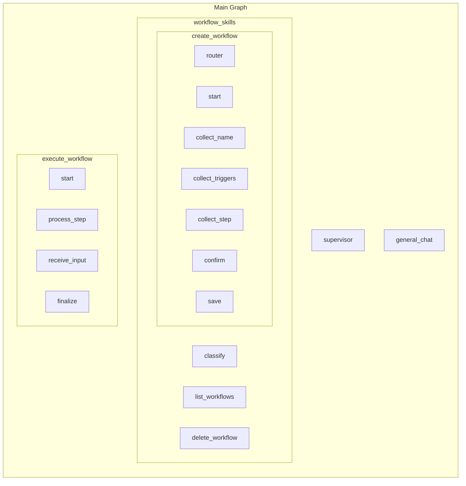
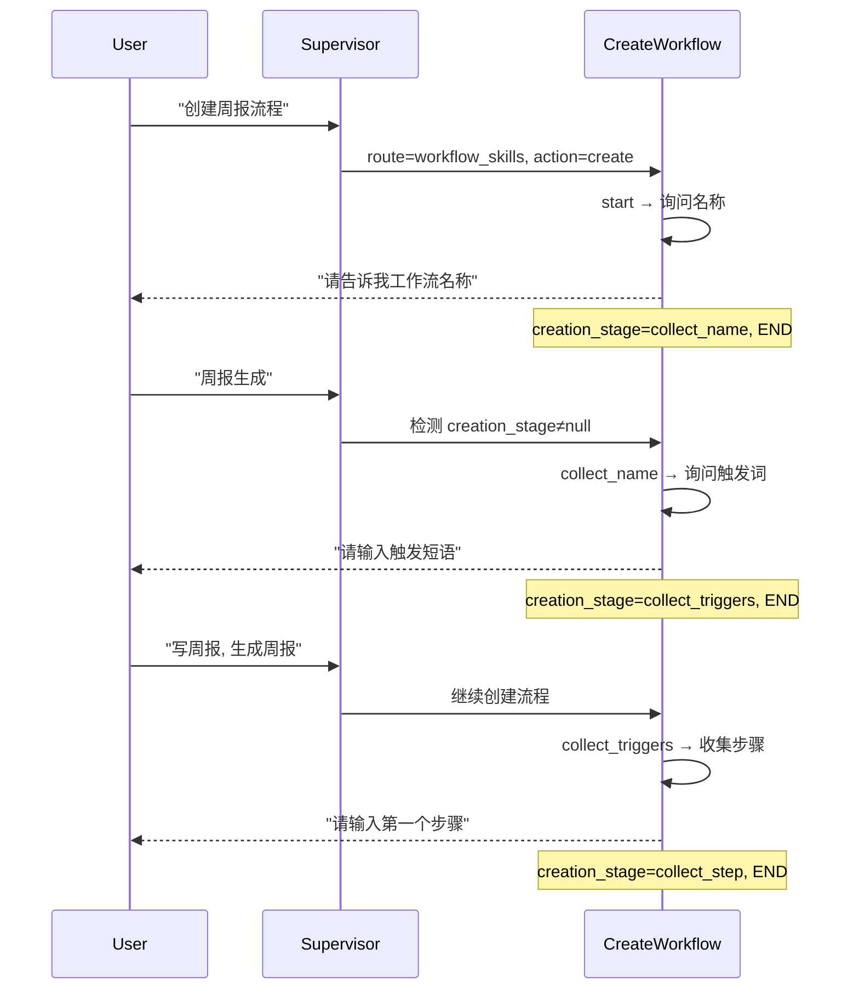
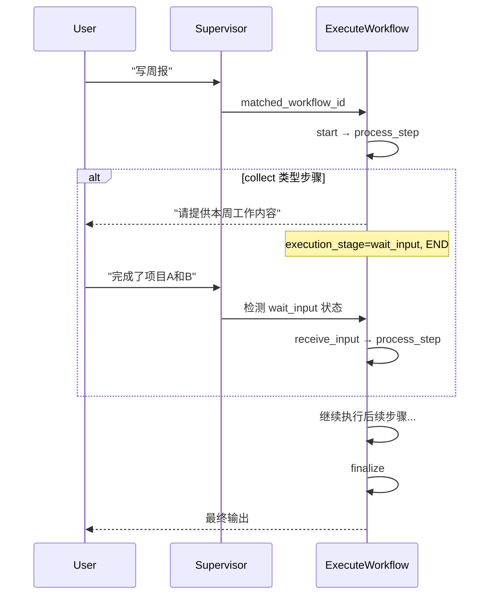

# LangGraph 图结构

## 主图 (Main Graph)

## workflow_skills 子图

## create_workflow 子图 (嵌套)

## execute_workflow 子图

## 图结构层级关系

## 关键路由逻辑

| 路由函数 | 位置 | 判断依据 |
|---------|------|---------|
| `_get_route()` | 主图 | `state.route` |
| `_route_action()` | workflow_skills | `state.action` (create/delete/list) |
| `_route_creation_stage()` | create_workflow | `state.creation_stage` |
| `_route_entry_point()` | execute_workflow | `state.execution_stage == "wait_input"` |
| `_route_execution_stage()` | execute_workflow | `state.execution_stage` |

## 文件对应关系

| 组件 | 文件路径 |
|-----|---------|
| 主图构建 | `graph/builder.py` |
| 主图状态 | `graph/state.py` |
| general_chat 节点 | `graph/nodes.py` |
| supervisor 节点 | `agents/supervisor.py` |
| workflow_skills 子图 | `graph/subgraphs/workflow_skills.py` |
| execute_workflow 子图 | `graph/subgraphs/workflow_execution.py` |

## Human-in-the-loop 机制

### 工作流创建 (create_workflow)

每个阶段处理完成后都会 `→ END`，暂停等待用户下一次输入。下次用户输入时，通过 `creation_stage` 状态路由到对应的阶段节点继续执行。

### 工作流执行 (execute_workflow)

## 状态字段说明

| 字段 | 类型 | 用途 |
|-----|------|-----|
| `messages` | `Annotated[list, add_messages]` | 对话历史 |
| `route` | `str` | 主图路由目标 |
| `action` | `str` | workflow_skills 操作类型 |
| `creation_stage` | `str` | 创建工作流当前阶段 |
| `execution_stage` | `str` | 执行工作流当前阶段 |
| `workflow_collection` | `dict` | 所有工作流集合 |
| `draft_*` | 各类型 | 创建中的工作流草稿字段 |
| `execution_*` | 各类型 | 执行中的工作流状态字段 |
